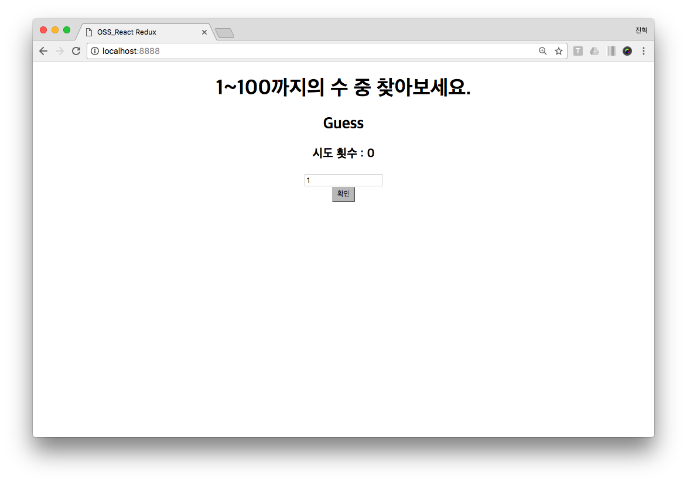
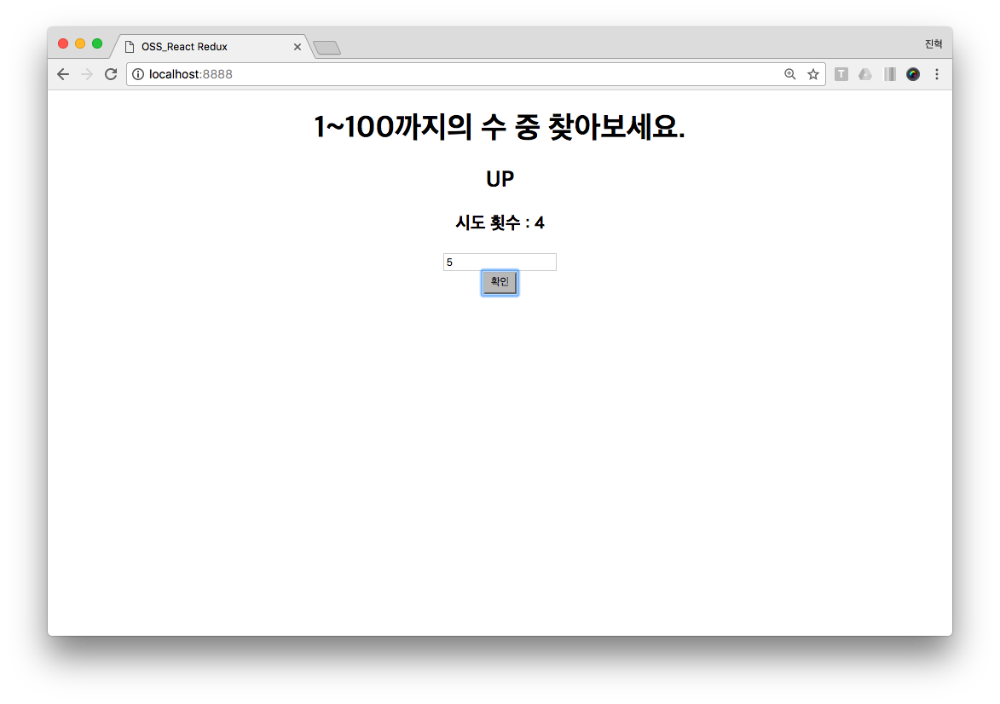

# React-Redux App
- 공개소프트웨어 과제로 Redux를 이용한 React App을 만드는 것

# Up Down 게임

술자리에서 하는 게임과 유사한 게임으로
- 1~100까지의 수 중 랜덤으로 숫자가 정해짐

- Textbox에 숫자를 입력한 후 확인 버튼을 눌러서 결과를 확인
- 만약 정해진 숫자보다 낮다면 'Up', 정해진 숫자보다 높다면 'Down'이 출력

- 맞는 답을 입력할시 'Correct'가 출력

- 시도 횟수 또한 출력됨

출처 : https://velopert.com/1266 포스팅 예제를 기반으로 작성 

# Redux에 대해 조사한 내용은 REPORT.ME 파일에 작성하였습니다!
