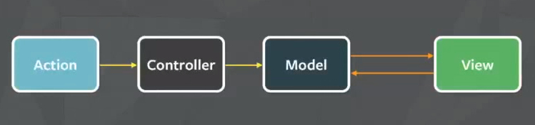
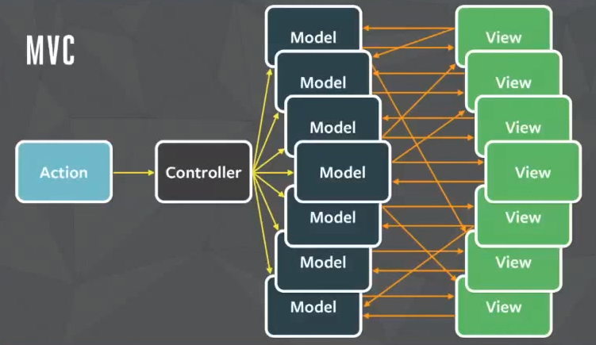

#Redux
- React.js를 통하여 만들어진 어플리케이션에서 데이터 교류 및 state 관리를 쉽고 효율적으로 하게 해주는 것
- JavaScript 어플리케이션에서 data-state 와 UI-state를 관리해주는 도구
- 상태적 데이터 관리가 시간의 흐름에 따라 복잡해질수도 있는 싱글 페이지 어플리케이션에서 유용하게 사용
- React 외에도, jQuery 혹은 Angular를 사용하는 어플리케이션에서도 사용 될 수 있음

* React에서 데이터흐름은 단일 방향으로만 흐른다!

MVC -> Flux -> Redux

MVC(Model, View, Controller)
: Action이 입력되면, Controller는 Model이 지니고 있는 데이터를 조회 혹은 업데이트하면, 이 변화가 View에 반영되는 구조 또한, View에서 Model의 데이터에 접근 또한 가능

하지만!

이 경우엔? ㅠㅠ

이를 해결하기 위해서 나온 것이 FLUX!

Action을 받으면 Dispatcher가 Action들을 통제하여 Store의 데이터를 업데이트, 그리고 변동 사항 있을 시 View에 리렌더링


View에서 또한 Dispatcher로 Action 보낼 수 있음.

Dispatcher는 작업이 중첩되지 않도록 해줌. Action이 Dispatcher를 통해 Store의 데이터를 처리하고, 그 작업이 끝날 때까지 다른 Action들을 대기

Redux는, Flux 아키텍쳐를 좀 더 편리하게 사용 할 수 있도록 해주는 라이브러리

#Redux의 3가지 원칙!

# 첫째, Single Source of Truth
Redux는 어플리케이션의 state를 위해 단 한개의 store를 사용!
모든 state가 한 곳에 있기 때문에, Single Source of Truth라고 부름
(Flux와 주요한 차이, Flux는 Store가 여러개)

보통 store의 데이터 구조는 개발자 나름아니, nested 된 구조로 주로 이루어져 있음.
JavaScript 객체로, { { {} {} {} }, {} } 이런 식으로

# 둘째, State is read-only
어플리케이션에서 state를 ‘직접’ 변경 할 수는 없다는 의미.
state를 변경하기 위해서는, action이 dispatch 되어야 한다.

# 셋째, Changes are made with Pure Functions
action을 dispatch하여 상태 값을 변경하는 과정에서 받아온 action 객체를 처리하는 함수를
Reducer라고 부름. 
action은 어떤 변화를 일어나야 할 지 알려주는 객체
Reducer는 그 정보를 받고 어플리케이션의 상태를 어떻게 바꿀지 정의

Reducer는 ‘순수 함수’로만 작성되어야한다.
순수 함수 :
- 외부 네트워크 혹은 데이터베이스에 접근하지 않아야 함
- Return 값은 오직 parameter 값에만 의존되어야한다.
- 인수는 변경되지 않아야한다.
- 같은 인수로 실행된 함수는 언제나 같은 결과를 반환해야한다.
- 순수하지 않은 API 호출은 하지 말아야 한다.(Data 및 Math의 함수 등)

